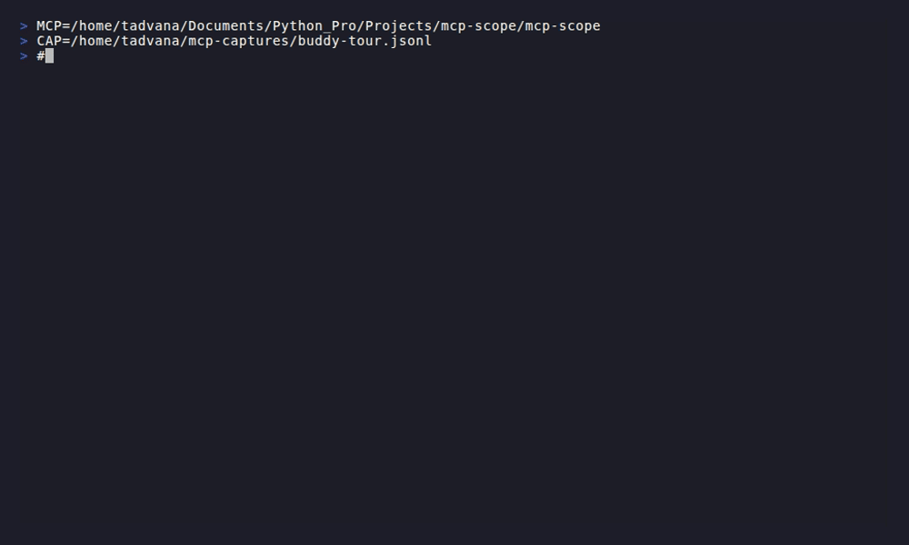

# mcp-scope

**tcpdump for MCP.** A transparent JSON-RPC capture, viewer, and diff tool for the Model Context Protocol.



> Status: v0.1.0. Core capture/view/stats/check/replay/diff/tui implemented. Open an issue if you'd use this.

---

## What it does

`mcp-scope` sits between any MCP client (Claude Desktop, Cursor, Copilot, your own script) and any MCP server, silently records every JSON-RPC frame, and gives you the tools to inspect, summarise, and diff what happened.

You don't change your client. You don't change your server. You prepend `mcp-scope capture --` and keep going.

```
┌──────────────┐    JSON-RPC    ┌────────────┐    JSON-RPC    ┌──────────────┐
│  MCP client  │ ◄────────────► │ mcp-scope  │ ◄────────────► │  MCP server  │
└──────────────┘                └─────┬──────┘                └──────────────┘
                                      │
                                      ▼
                                session.jsonl
```

## Why it exists

The MCP debugging ecosystem is full of *interactive* tools — TUIs and web UIs you drive yourself to call tools and watch responses. None of them help when the bug only reproduces inside Claude Desktop, Cursor, or your CI pipeline. You need to see what *actually* flowed on the wire during a real session.

`mcp-scope` is passive. It captures real traffic from real clients. Then you analyse it offline.

## Install

**macOS / Linux — download a pre-built binary:**
```sh
# macOS (Apple Silicon)
curl -L https://github.com/SSanju/mcp-scope/releases/latest/download/mcp-scope_darwin_arm64.tar.gz | tar xz
sudo mv mcp-scope /usr/local/bin/

# macOS (Intel)
curl -L https://github.com/SSanju/mcp-scope/releases/latest/download/mcp-scope_darwin_amd64.tar.gz | tar xz
sudo mv mcp-scope /usr/local/bin/

# Linux (amd64)
curl -L https://github.com/SSanju/mcp-scope/releases/latest/download/mcp-scope_linux_amd64.tar.gz | tar xz
sudo mv mcp-scope /usr/local/bin/
```

**macOS / Linux — Homebrew tap**:
```sh
brew tap SSanju/mcp-scope
brew install mcp-scope
```

**Go install (requires Go 1.22+):**
```sh
go install github.com/SSanju/mcp-scope/cmd/mcp-scope@latest
```

Single static Go binary. No Node, no Python, no browser, no localhost port.

## Quick start

### Capture a session

Wrap a stdio server — place `mcp-scope capture -o session.jsonl --` before the server command:
```sh
mcp-scope capture -o session.jsonl -- node build/index.js
mcp-scope capture -o session.jsonl -- python server.py --port 0
```

Wrap an HTTP/SSE server — point your client at the proxy, proxy forwards to upstream:
```sh
mcp-scope capture --upstream https://my-server.internal/mcp --listen :8080 -o session.jsonl
# then point your client at http://localhost:8080 instead of the real server
```

Every JSON-RPC frame in either direction is timestamped and written to `session.jsonl`.

### View a capture

```sh
# Non-interactive — pipe-friendly, composable with grep/less
mcp-scope view session.jsonl
mcp-scope view --kind req --method tools/call session.jsonl
mcp-scope view --grep '"isError":true' -v session.jsonl

# Live tail — prints new frames as they arrive (like tail -f)
mcp-scope view --follow session.jsonl

# Interactive TUI — scrollable two-pane explorer with live regex filter
mcp-scope tui session.jsonl
```

### Get a summary

```sh
mcp-scope stats session.jsonl
```

```
Requests:
  method                                    count   errors      p50      p95      p99      max
  tools/call                                   47        1     22ms     89ms    180ms    340ms
  tools/list                                    3        0      8ms     14ms     14ms     14ms
  initialize                                    1        0     12ms     12ms     12ms     12ms

Notifications:
  method                                    count
  notifications/cancelled                       2

Summary:
  frames:       56
  unmatched:    0 (requests without a response in capture)
  sessions:     1
  connects:     1
  disconnects:  1
  duration:     41m44s
  transports:   stdio=56
```

### Diff two captures

```sh
mcp-scope diff baseline.jsonl candidate.jsonl
```

Schema-level diff. Extracts `tools/list`, `resources/list`, and `prompts/list` declarations
from each capture and classifies every change:

```
BREAKING  tools/call:write_file          required param "mode" added
BREAKING  tools/call:delete_file         tool removed
SAFE      tools/call:read_file.encoding  optional param added
SAFE      tools/call:list_dir            new tool
INFO      tools/call:read_file           description changed
```

Exit code `1` if any breaking change is found — drop into CI to gate server upgrades:

```yaml
- run: mcp-scope diff baseline.jsonl candidate.jsonl
```

Use `--frames` to compare raw frame sequences instead of schemas:

```sh
mcp-scope diff --frames session-a.jsonl session-b.jsonl
```

## How it compares

| Tool | Category | What it does |
|------|----------|--------------|
| **mcp-scope** | Passive proxy | Records real traffic from real clients. Diffs captures. |
| MCP Inspector (official) | Web debugger | You drive it to call tools. Browser-based. |
| mcp-tui | TUI debugger | You drive it interactively in the terminal. |
| par-mcp-inspector-tui | TUI debugger | You drive it; rich JSON-RPC pane. |
| mcp-probe | TUI debugger + CI | You drive it; built-in record/replay inside its own session. |
| mcptools (`f/mcptools`) | CLI client | One-shot tool calls from the shell. |

Every other tool in the ecosystem is *active* — you sit at the keyboard and drive it. `mcp-scope` is the only one that watches an existing client/server pair without disturbing either side.

## Roadmap

**MVP** ✅
- [x] `capture` — stdio + SSE + streamable HTTP proxy, `--redact` for secret scrubbing
- [x] `view` — non-interactive pretty-printer with composable filter flags
- [x] `tui` — interactive two-pane TUI explorer (bubbletea)
- [x] `stats` — per-method latency (p50/p95/p99/max) and error summary

**v0.2** ✅
- [x] `diff` — schema diff (tools/resources/prompts), breaking-change classifier, CI exit codes
- [x] `check` — JSON-RPC protocol validator, CI exit codes

**v0.3** ✅
- [x] `replay` — fire recorded calls at a different server for regression testing

## Explicitly not building

- An interactive debugger to drive tool calls (mcp-tui, par's, mcp-probe already do this)
- A web UI (official Inspector does this)
- LLM-in-the-loop testing (MCPJam does this)
- A YAML test DSL (the diff exit code is the contract gate)
- Schema-aware input forms (no input forms — this is a passive tool)

## Contributing

 Open an issue describing your use case before sending a PR — the scope is deliberately narrow and the answer to most "could it also do X" questions is no.

## License

MIT.
