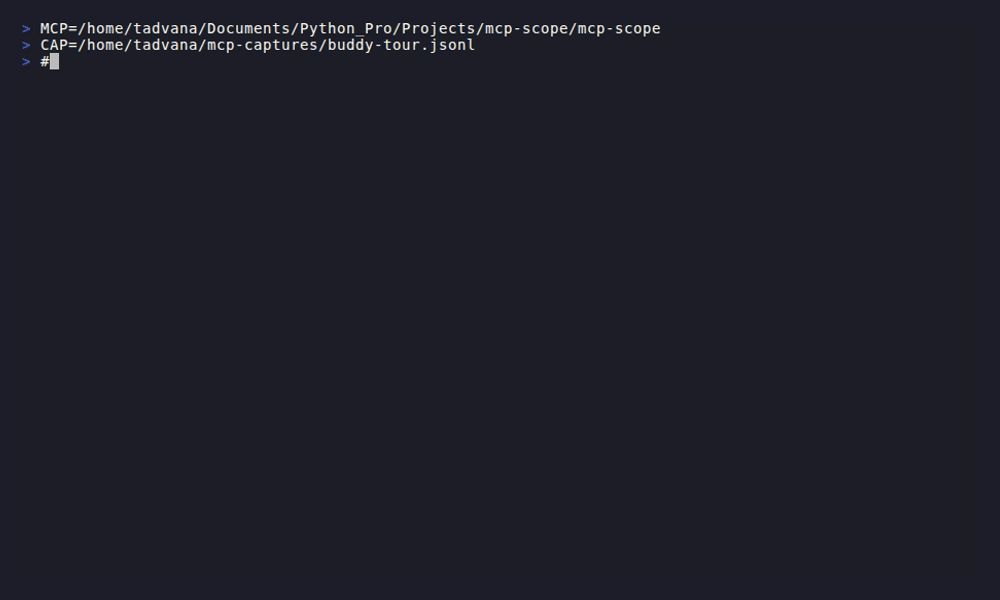

# mcp-scope

Your MCP server works in Inspector. It fails silently in Claude Desktop, Cursor, or Gemini CLI.
There are no logs. You can't reproduce it outside the real client. **mcp-scope shows you exactly what
flowed on the wire — without changing the client or the server.**

```
┌──────────────┐    JSON-RPC    ┌────────────┐    JSON-RPC    ┌──────────────┐
│  MCP client  │ ◄────────────► │ mcp-scope  │ ◄────────────► │  MCP server  │
│ Claude/Cursor│                │  (proxy)   │                │  your server │
└──────────────┘                └─────┬──────┘                └──────────────┘
                                      │
                                      ▼
                                session.jsonl   ← every frame, timestamped
```

Prepend `mcp-scope capture --` to your server command. Keep using your real client normally.
When something goes wrong, the capture has the answer.



---

## What it does

`mcp-scope` is a **passive proxy**: it sits between a real MCP client and server, records every
JSON-RPC frame to a `.jsonl` file, and gives you six tools to answer every question that comes after:

| Command | Question it answers |
|---------|-------------------|
| `view` | What exactly flowed on the wire? What was in that frame? |
| `stats` | Which methods are slow? Where are errors coming from? |
| `check` | Is this server speaking valid JSON-RPC? Will it break clients? |
| `diff` | Did my server's tool schemas change between versions? Is any change breaking? |
| `replay` | Does the new server version behave the same as the old one? |
| `tui` | Let me explore this interactively with live filtering. |

## Why it exists

Every other MCP debugging tool is *active* — you sit at the keyboard and drive it. That works until
the bug only reproduces inside Claude Desktop, a CI runner, or a real AI agent in flight. Then you're
stuck.

`mcp-scope` captures what *actually happened* in a real session. Then you analyse it offline at your own pace.

## Install

**macOS / Linux — download a pre-built binary:**
```sh
# macOS (Apple Silicon)
curl -L https://github.com/SSanju/mcp-scope/releases/latest/download/mcp-scope_darwin_arm64.tar.gz | tar xz
sudo mv mcp-scope /usr/local/bin/

# macOS (Intel)
curl -L https://github.com/SSanju/mcp-scope/releases/latest/download/mcp-scope_darwin_amd64.tar.gz | tar xz
sudo mv mcp-scope /usr/local/bin/

# Linux (amd64)
curl -L https://github.com/SSanju/mcp-scope/releases/latest/download/mcp-scope_linux_amd64.tar.gz | tar xz
sudo mv mcp-scope /usr/local/bin/
```

**macOS / Linux — Homebrew tap**:
```sh
brew tap SSanju/mcp-scope
brew install mcp-scope
```

**Go install (requires Go 1.22+):**
```sh
go install github.com/SSanju/mcp-scope/cmd/mcp-scope@latest
```

Single static Go binary. No Node, no Python, no browser, no localhost port.

## Quick start

### Capture a session

Wrap a stdio server — place `mcp-scope capture -o session.jsonl --` before the server command:
```sh
mcp-scope capture -o session.jsonl -- node build/index.js
mcp-scope capture -o session.jsonl -- python server.py --port 0
```

Wrap an HTTP/SSE server — point your client at the proxy, proxy forwards to upstream:
```sh
mcp-scope capture --upstream https://my-server.internal/mcp --listen :8080 -o session.jsonl
# then point your client at http://localhost:8080 instead of the real server
```

Every JSON-RPC frame in either direction is timestamped and written to `session.jsonl`.

### View a capture

```sh
# Non-interactive — pipe-friendly, composable with grep/less
mcp-scope view session.jsonl
mcp-scope view --kind req --method tools/call session.jsonl
mcp-scope view --grep '"isError":true' -v session.jsonl

# Live tail — prints new frames as they arrive (like tail -f)
mcp-scope view --follow session.jsonl

# Interactive TUI — scrollable two-pane explorer with live regex filter
mcp-scope tui session.jsonl
```

### Get a summary

```sh
mcp-scope stats session.jsonl
```

```
Requests:
  method                                    count   errors      p50      p95      p99      max
  tools/call                                   47        1     22ms     89ms    180ms    340ms
  tools/list                                    3        0      8ms     14ms     14ms     14ms
  initialize                                    1        0     12ms     12ms     12ms     12ms

Notifications:
  method                                    count
  notifications/cancelled                       2

Summary:
  frames:       56
  unmatched:    0 (requests without a response in capture)
  sessions:     1
  connects:     1
  disconnects:  1
  duration:     41m44s
  transports:   stdio=56
```

### Diff two captures

```sh
mcp-scope diff baseline.jsonl candidate.jsonl
```

Schema-level diff. Extracts `tools/list`, `resources/list`, and `prompts/list` declarations
from each capture and classifies every change:

```
BREAKING  tools/call:write_file          required param "mode" added
BREAKING  tools/call:delete_file         tool removed
SAFE      tools/call:read_file.encoding  optional param added
SAFE      tools/call:list_dir            new tool
INFO      tools/call:read_file           description changed
```

Exit code `1` if any breaking change is found — drop into CI to gate server upgrades:

```yaml
- run: mcp-scope diff baseline.jsonl candidate.jsonl
```

Use `--frames` to compare raw frame sequences instead of schemas:

```sh
mcp-scope diff --frames session-a.jsonl session-b.jsonl
```

## When to use mcp-scope vs other tools

| Situation | Use this |
|-----------|----------|
| "My server works in Inspector but fails in Claude Desktop" | **mcp-scope** — captures the real client session |
| "I need to see what a Gemini CLI MCP call returns right now" | MCP Inspector or mcptools |
| "I want to interactively call my server's tools" | mcp-tui or mcp-probe |
| "I shipped a new server version — did anything break for clients?" | **mcp-scope diff** |
| "My CI needs to block on protocol violations" | **mcp-scope check --strict** |
| "I need to replay old traffic against a new server" | **mcp-scope replay** |

See the [examples/](examples/) folder for step-by-step walkthroughs for Gemini CLI, Google ADK MCPToolset, mcp-toolbox, and CI/CD pipelines.

## Examples

- [`examples/mcp-toolbox/`](examples/mcp-toolbox/) — Capturing and validating a Google mcp-toolbox session; protocol bugs found with `check --strict`
- [`examples/gemini-cli/`](examples/gemini-cli/) — Debugging a Gemini CLI MCP integration silently failing
- [`examples/adk-mcptoolset/`](examples/adk-mcptoolset/) — Diagnosing a Google ADK MCPToolset agent making unexpected tool calls
- [`examples/ci-github-actions/`](examples/ci-github-actions/) — Full CI workflow: protocol validation + breaking-change gate on every server push

## Roadmap

**MVP** ✅
- [x] `capture` — stdio + SSE + streamable HTTP proxy, `--redact` for secret scrubbing
- [x] `view` — non-interactive pretty-printer with composable filter flags
- [x] `tui` — interactive two-pane TUI explorer (bubbletea)
- [x] `stats` — per-method latency (p50/p95/p99/max) and error summary

**v0.2** ✅
- [x] `diff` — schema diff (tools/resources/prompts), breaking-change classifier, CI exit codes
- [x] `check` — JSON-RPC protocol validator, CI exit codes

**v0.3** ✅
- [x] `replay` — fire recorded calls at a different server for regression testing

## Explicitly not building

- An interactive debugger to drive tool calls (mcp-tui, par's, mcp-probe already do this)
- A web UI (official Inspector does this)
- LLM-in-the-loop testing (MCPJam does this)
- A YAML test DSL (the diff exit code is the contract gate)
- Schema-aware input forms (no input forms — this is a passive tool)

## Contributing

 Open an issue describing your use case before sending a PR — the scope is deliberately narrow and the answer to most "could it also do X" questions is no.

## License

MIT.
